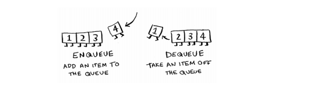
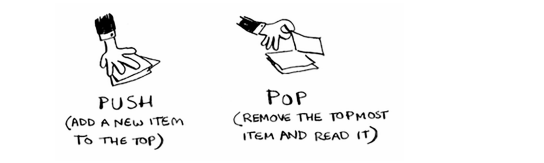
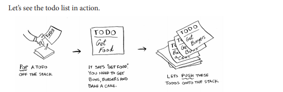

# Stacks & queues

this is a friendly introduction and exaplination for stacks and queues.

## Queues

A queue works exactly like it does in
real life. Suppose you and your friend
are queueing up at the bus stop. If you’re
before him in the queue, you get on the
bus first. A queue works the same way.
Queues are similar to stacks. You can’t
access random elements in the queue.
Instead, there are two only operations,
enqueue and dequeue.



If you enqueue two items to the list, the first item you added will be
dequeued before the second item. You can use this for your search list!
People who are added to the list first will be dequeued and searched
first.
The queue is called a `FIFO` data structure: First In, First Out. In
contrast, a stack is a `LIFO` data structure: Last In, First Out.


## Stack

Suppose you’re throwing a barbecue. You keep a todo list for the
barbecue, in the form of a stack of sticky notes.
Remember back when we talked about arrays and lists,
and you had a todo list? You could add todo items
anywhere to the list or delete random items. The stack of
sticky notes is much simpler. When you insert an item,
it gets added to the top of the list. When you read an item,
you only read the topmost item, and it’s taken off the list. So your todo
list has only two actions: push (insert) and pop (remove and read).


Let’s see the todo list in action.


This data structure is called a stack. The stack is a simple data structure.
You’ve been using a stack this whole time without realizing it!

## Quiz

1.  ........ form of access is used to add remove nodes from a stack.

    [ ] FIFO

    [ ] LIFO

    [ ] none

    [ ] all

2.  Consider the following operation performed on a stack of size

        ``` Push(1);

        Pop();

        Push(2);

        Push(3);

        Pop();

        Push(4);

        Pop();

        Pop();

        Push(5);
        ```

    After the completion of all operation, the number of elements present on stack are

    [ ] 1

    [ ] 2

    [ ] 3

    [ ] 4

3.  What method is used to add an element to a Stack?

    [ ] `dequeue()`

    [ ] `push()`

    [ ] `pop()`

    [ ] `enqueue()`

4.  What method is used to view the next element to be removed from a stack?

    [ ] `dequeue()`

    [ ] `peek()`

    [ ] `NextItem()`

    [ ] `pop()`
