# HTML5 Layout

HTML5 is introducing a new set of
elements that help define the structure of
a page. They are covered here in this file.

## Traditional Html Elements 
We used `<div>` for a long time to gather related elements togther, such as elements from a header or footer.

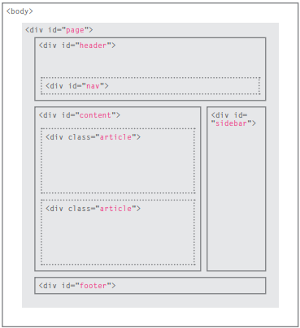
<br>
Html5 introduces  a new set of elements that allow you to divide up the
parts of a page. They are still subject to change, but that has not
stopped many web page authors using them already.

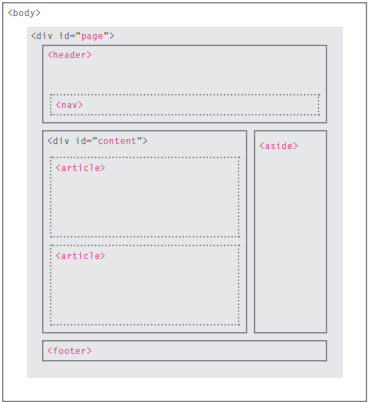

there are many HTML5 elements that we can use: 

### Headers & Footers

`<header> <footer>`.

they can used for: 
- The header/footer appears at the top/bottom of the pag e.
- a header/footer for an `<article> <footer>` within the page.

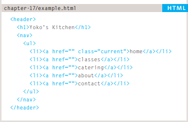


### Navigation
`<nav>`
This element is used for containing navigational blocks on the site.
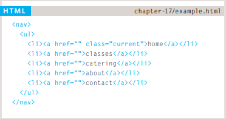

### Articles 
`<article>`
the article element is used as container for any section of the page that code stand alone. <br>
the article elements can be nested inside each others.

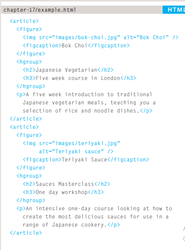

### Asides 
`<aside>`

the aside element has two purposes:
The `<aside>` element has two
purposes, depending on whether
it is inside an <article>
element or not.

- **inside the `<article>`**:<br>
contain information that is related to the article but not essential to its
overall meaning

- **outside the `<article>`**:<br>
acts as a container
for content that is related to
the entire page.

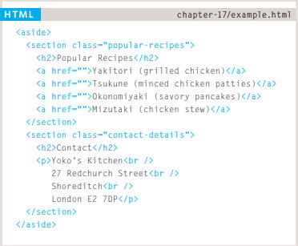

### Sections
`<section>`
we use the section element to group a related content togther, and each section can have a heading.
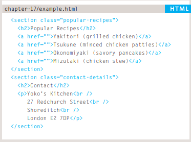

### Heading Groups
`<hgroup>`
we use the heading groups to to group a set of heading `<h1> - <h6>`

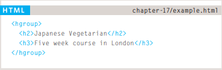

### Figures 
`<figure> <figcaption>`

It can be used to contain any content that is referenced from the main flow of an article.
For this reason, it should only be used when the content simply references the element
- Images
- Videos
- Graphs
- Diagrams
- Code samples

the `<figure>` element should contain the `<figcaption>`which provides a text description for the content of the element.

## Summary

- The new HTML5 elements indicate the purpose of
different parts of a web page and help to describe
its structure.

- The new elements provide clearer code (compared
with using multiple <div> elements).

- Older browsers that do not understand HTML5
elements need to be told which elements are
block-level elements.

- To make HTML5 elements work in Internet Explorer 8
(and older versions of IE), extra JavaScript is needed,
which is available free from Google. 


# Html Structure 
In all kinds of documents, structure is very important in helping
readers to understand the messages you are trying to convey
and to navigate around the document.

## HTML Describes the Structure of Pages
Each
element has an opening tag and a closing tag.

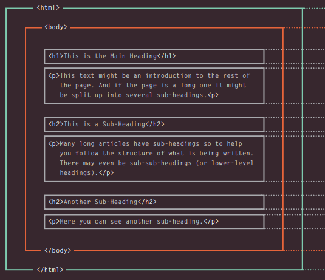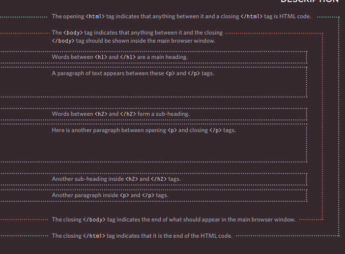

### A closer look at the tag 

**opening tag**:

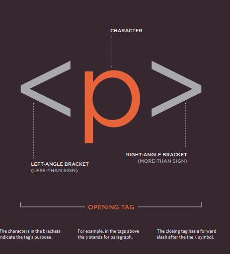

**a closing tag**:

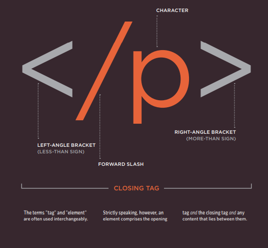

### Attributes
Attributes provide additional information about the contents of an element. They appear on the opening tag of the element and are made up of two parts: a `name` and a `value`, separated by an equals sign.

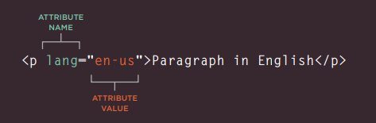

### Body, Head and Title 

- `<body>`:
Everything inside this element is
shown inside the main browser
window.
- `<head>`:This contains informationabout the page(rather than information that is shown within the main part of the browser window that is highlighted in blue on the opposite page).

- `<title>`: The contents of the `<title>` element are either shown in the top of the browser, above where you usually type in the URL of
the page you want to visit, or
on the tab. 
## Summary
- HTML pages are text documents.
- X HTML uses tags (characters that sit inside angled
brackets) to give the information they surround special
meaning.
- Tags are often referred to as elements.
- Tags usually come in pairs. The opening tag denotes
the start of a piece of content; the closing tag denotes
the end.
- Opening tags can carry attributes, which tell us more
about the content of that element.
- Attributes require a name and a value.
- To learn HTML you need to know what tags are
available for you to use, what they do, and where they
can go.


# Extra Markup

Since the web was first created, there have
been several different versions of HTML. 

- **HTML 4**<br>
 
    Although HTML 4 had some
    presentational elements to
    control the appearance of pages,
    authors are not recommended to
    use them any more. (Examples
    include the `<center>` element
    for centering content on a
    page, `<font>` for controlling
    the appearance of text, and
    `<strike>` to put a line through
    the text — all of these can be
    achieved with CSS instead.)

- XHTML 1.0 <br>
*Released 1997* <br>
    Since
HTML was the most widely used
markup language around, it was
decided that HTML 4 should be
reformulated to follow the rules
of XML and it was renamed
XHTML. This meant that
authors had to follow some new,
more strict rules about writing
markup.

- HTML5 <br>
*Released 2000*
    Despite the fact that HTML5
is not yet completed, you can
safely take advantage of the
new features of the language as
long as you endeavour to ensure
that users with older browsers
will be able to view your pages
(even though some of the extra
features will not be visible to
them).

## DOCTYPEs
Because there have been
several versions of HTML, each
web page should begin with a
DOCTYPE declaration to tell a
browser which version of HTML
the page is using (although
browsers usually display the
page even if it is not included).
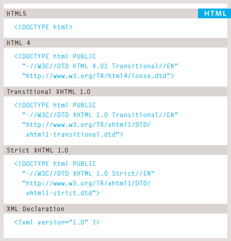

## comments in HTML 
If you want to add a comment
to your code that will not be
visible in the user's browser, you
can add the text between these
characters:
```
<!-- comment goes here -->
```
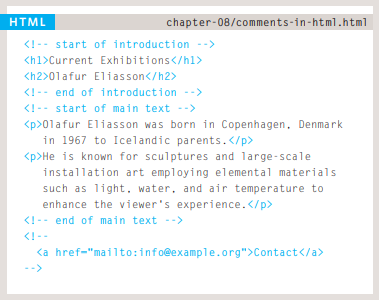

## ID attribute 
Every HTML element can carry
the id attribute. It is used to
uniquely identify that element
from other elements on the
page. 

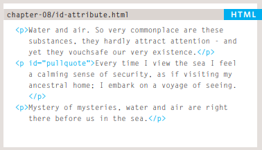

## Class attribute 
Every HTML element can
also carry a class attribute.
Sometimes, rather than uniquely
identifying one element within
a document, you will want a
way to identify several elements
as being different from the
other elements on the page.


## Block Elemnts 
Some elements will always
appear to start on a new line in
the browser window. These are
known as block level elements. 
Examples of block elements are
`<h1>`, `<p>`, `<ul>`, and `<li>`. 

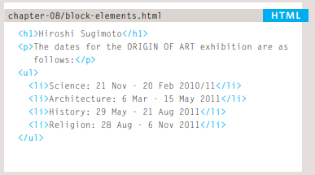

## Inline Elements 
Some elements will always
appear to continue on the
same line as their neighbouring
elements. These are known as
inline elements.
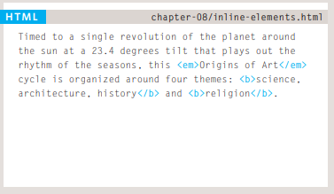

## IFrames 
An iframe is like a little window
that has been cut into your
page — and in that window you
can see another page. The term
iframe is an abbreviation of inline
frame.
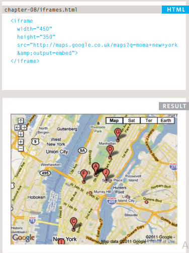

## Escape charcter 
There are some characters that are used in
and reserved by HTML code. (For example, the
left and right angled brackets.)


## Summary
- DOCTYPES tell browsers which version of HTML you
are using.
- You can add comments to your code between the
`<!-- and -->` markers.

- The id and class attributes allow you to identify
particular elements. 

- The `<div>` and `<span>` elements allow you to group
block-level and inline elements together.

- `<iframes>` cut windows into your web pages through
which other pages can be displayed.

- The `<meta>` tag allows you to supply all kinds of
information about your web page.

- Escape characters are used to include special
characters in your pages such as <, >, and ©.

# Process & Design

Every website should be designed for the
target audience—not just for yourself or the
site owner. It is therefore very important to
understand who your target audience is.

### Target Audience
**individuals**:

- What is the age range of your target audience?
- Will your site appeal to more women or men? What is the mix?
- Which country do your visitors live in?
- Do they live in urban or rural areas?
- What is the average income of visitors?

**Companies**:
- What is the size of the company or relevant department?

- What is the position of people in the company who visit your site?

- Will visitors be using the site for themselves or for someone else?

- How large is the budget they control.

## Why People Visit YOUR Website

Now that you know who your visitors are, you
need to consider why they are coming. While
some people will simply chance across your
website, most will visit for a specific reason.

Your content and design should
be influenced by the goals of
your users.
To help determine why people
are coming to your website,
there are two basic categories of
questions you can ask:

1. The first attempts to discover
the underlying motivations for
why visitors come to the site.
2. The second examines the
specific goals of the visitors.
These are the triggers making
them come to the site now.

## Site Maps 
The aim is to create a diagram
of the pages that will be used
to structure the site. This is
known as a **site map** and it will
show how those pages can be
grouped.
To help you decide what
information should go on each
page, you can use a technique
called **card sorting**.

Example:

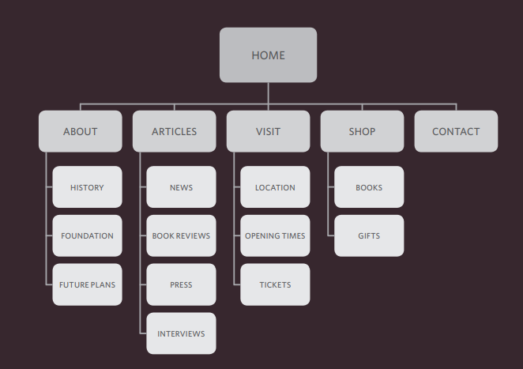

## WireFrames
A wireframe is a simple sketch of the key
information that needs to go on each page of a
site. It shows the hierarchy of the information
and how much space it might require.

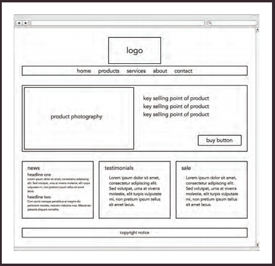

## Summary

- It's important to understand who your target audience
is, why they would come to your site, what information
they want to find and when they are likely to return.

- X Site maps allow you to plan the structure of a site.

- Wireframes allow you to organize the information that
will need to go on each page.

- Design is about communication. Visual hierarchy helps
visitors understand what you are trying to tell them.


