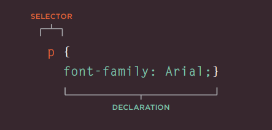
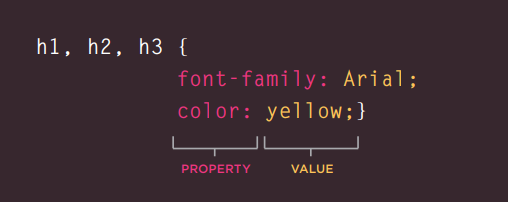
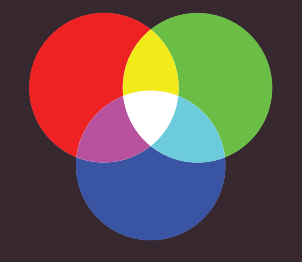
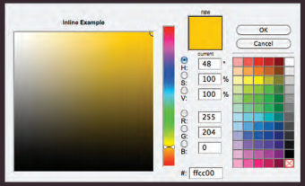
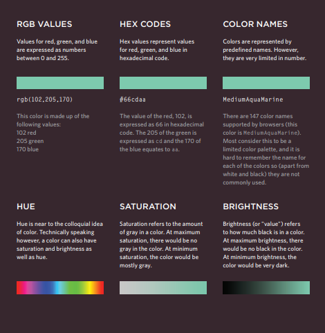
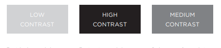
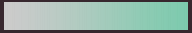

# Introducing Css

CSS allows you to create rules that specify how the content of
an element should appear. For example, you can specify that
the background of the page is cream, all paragraphs should
appear in gray using the Arial typeface, or that all level one
headings should be in a blue, italic, Times typeface.


## CSS Associates Style rules with HTML elements

CSS works by associating rules with HTML elements. These rules govern
how the content of specified elements should be displayed. A CSS rule
contains two parts: a selector and a declaration. 



## CSS Properties Affect How Elements Are Displayed

CSS declarations sit inside curly brackets and each is made up of two
parts: a property and a value, separated by a colon. You can specify
several properties in one declaration, each separated by a semi-colon.



## Example INTRODUCING CSS

This example uses two documents: the HTML file (example.html)
and a separate CSS file (example.css). The fifth line of HTML uses the
`<link>` element to indicate where the CSS file is located.

```
<!DOCTYPE html>
<html>
<head>
 <title>Introducing CSS</title>
 <link href="css/example.css" type="text/css"
 rel="stylesheet" />
</head>
<body>
 <h1>From Garden to Plate</h1>
 <p>A <i>potager</i> is a French term for an
 ornamental vegetable or kitchen garden ... </p>
 <h2>What to Plant</h2>
 <p>Plants are chosen as much for their functionality
 as for their color and form ... </p>
</body>
</html>
```

```
body {
font-family: Arial, Verdana, sans-serif;}
h1, h2 {
color: #ee3e80;}
p {
color: #665544;}
```

## Using External CSS 

- `<link>`:

    The `<link>` element can be used
in an HTML document to tell the
browser where to find the CSS
file used to style the page. It is an
empty element (meaning it does
not need a closing tag), and it
lives inside the <head> element.
It should use three attributes:
    
    - href 

        This specifies the path to the
        CSS file (which is often placed in
        a folder called css or styles).

    - type 

        This attribute specifies the type
        of document being linked to. The
        value should be text/css.

    - rel

        This specifies the relationship
        between the HTML page and
        the file it is linked to. The value
        should be stylesheet when
        linking to a CSS file.

- `<style>`

    You can also include CSS rules
    within an HTML page by placing
    them inside a `<style>` element,
    which usually sits inside the
    `<head>` element of the page. 


## CSS Selectors

There are many different types
of CSS selector that allow you to
target rules to specific elements
in an HTML document.  

The table on the opposite page
introduces the most commonly
used CSS selectors

``` 
<!DOCTYPE html>
<html>
<head>
 <title>CSS Selectors</title>
</head>
<body>
 <h1 id="top">Kitchen Garden Calendar</h1>
 <p id="introduction">Here you can read our
 handy guide about what to do when.</p>
 <h2>Spring</h2>
 <ul>
 <li><a href="mulch.html">
 Spring mulch vegetable beds</a></li>
 <li><a href="potato.html">
 Plant out early potatoes</a></li>
 <li><a href="tomato.html">
 Sow tomato seeds</a></li>
 <li><a href="beet.html">
 Sow beet seeds</a></li>
 <li><a href="zucchini.html">
 Sow zucchini seeds</a></li>
 <li><a href="rhubarb.html">
 Deadhead rhubarb flowers</a></li>
 </ul>
 <p class="note">
 This page was written by
 <a href="mailto:ivy@example.org">
 ivy@example.org</a> for
 <a href="http://www.example.org">Example</a>.
 </p>
 <p>
 <a href="#top">Top of page</a>
 </p>
</body>
</html>
```


## Summary 

- X CSS treats each HTML element as if it appears inside
its own box and uses rules to indicate how that
element should look.
- Rules are made up of selectors (that specify the
elements the rule applies to) and declarations (that
indicate what these elements should look like).
- X Different types of selectors allow you to target your
rules at different elements
- Declarations are made up of two parts: the properties
of the element that you want to change, and the values
of those properties. For example, the font-family
property sets the choice of font, and the value arial
specifies Arial as the preferred typeface.
- CSS rules usually appear in a separate document,
although they may appear within an HTML page.


# Colors 
Color can really bring your pages to life.


## Foreground Color (color)

The color property allows you
to specify the color of text inside
an element. You can specify any
color in CSS in one of three ways:

``` 
/* color name */
h1 {
color: DarkCyan;}
/* hex code */
h2 {
color: #ee3e80;}
/* rgb value */
p {
color: rgb(100,100,90);}
```
- rgb values 

    These express colors in terms
of how much red, green and
blue are used to make it up. For
example: `rgb(100,100,90)`.

- hex codes 

    These are six-digit codes that
    represent the amount of red,
    green and blue in a color,
    preceded by a pound or hash #
    sign. For example: `#ee3e80`.

- color names 

    There are 147 predefined color
names that are recognized
by browsers. For example:
`DarkCyan`. 

### Background color 

``` 
body {
background-color: rgb(200,200,200);}
h1 {
background-color: DarkCyan;}
h2 {
background-color: #ee3e80;}
p {
background-color: white;}
```
CSS treats each HTML element
as if it appears in a box, and the
background-color property
sets the color of the background
for that box.

You can specify your choice of
background color in the same
three ways you can specify
foreground colors: RGB values,
hex codes, and color names
(covered on the next page).
If you do not specify a
background color, then the
background is transparent. 

### Understanding Color
 
Every color on a computer screen is created by mixing amounts of red,
green, and blue. To find the color you want, you can use a color picker.

Computer monitors are made
up of thousands of tiny squares
called pixels (if you look very
closely at your monitor you
should be able to see them).



When the screen is not turned
on, it's black because it's not
emitting any light. When it's
on, each pixel can be a different
color, creating a picture.

The color of every pixel on the
screen is expressed in terms of
a mix of red, green, and blue —
just like on a television screen.



### Concepts 



### Contrast 
When picking foreground and background
colors, it is important to ensure that there is
enough contrast for the text to be legible.



## CSS 3 

## Opacity 

CSS3 introduces the opacity
property which allows you to
specify the opacity of an element
and any of its child elements.
The value is a number between
0.0 and 1.0 (so a value of 0.5
is 50% opacity and 0.15 is 15%
opacity).

The CSS3 rgba property allows
you to specify a color, just like
you would with an RGB value,
but adds a fourth value to
indicate opacity. This value is
known as an alpha value and is
a number between 0.0 and 1.0
(so a value of 0.5 is 50% opacity
and 0.15 is 15% opacity). The
rgba value will only affect the
element on which it is applied
(not child elements).

```
p.one {
background-color: rgb(0,0,0);
opacity: 0.5;}
p.two {
background-color: rgb(0,0,0);
background-color: rgba(0,0,0,0.5);}
```
**Result**:


### HSL Colors

CSS3 introduces an entirely new and intuitive
way to specify colors using hue, saturation,
and lightness values.

- hue 

Hue is the colloquial idea of
color. In HSL colors, hue is often
represented as a color circle
where the angle represents the
color, although it may also be
shown as a slider with values
from 0 to 360.


- saturation

Saturation is the amount of
gray in a color. Saturation is
represented as a percentage.
100% is full saturation and 0%
is a shade of gray



### lightness 

Lightness is the amount of
white (lightness) or black
(darkness) in a color. Lightness
is represented as a percentage.
0% lightness is black, 100%
lightness is white, and 50%
lightness is normal. Lightness
is sometimes referred to as
luminosity.


## Summury 


- Color not only brings your site to life, but also helps
convey the mood and evokes reactions.
- There are three ways to specify colors imn CSS :
RGB values, hex codes, and color names.

- Color picker can help you to find the color you want. 
- It is important to ensure that there is enough contrast between any text and the backgroung color.
- CSS3  has in troduced an extra value for RGB colors to indicate opacity. its is known as RGBA. 
- CSS3 also allows you to specify colors aas HSL values, 
with and optional opacity value. it is knon as HSLA.


