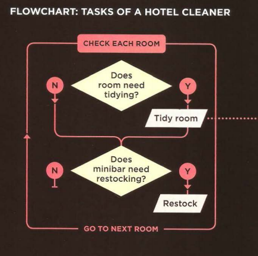
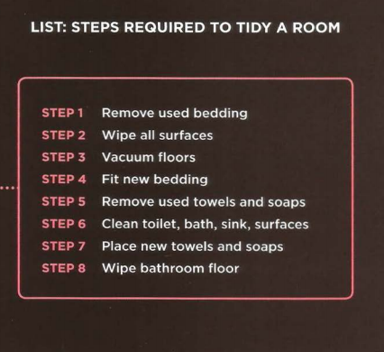

# JavaScript & JQuery

how JavaScript can be used
in browsers to make websites more interactive,
interesting, and user-friendly.

## Intro + Scripts

How JavaScript Makes Web Pages More Interactive ?

1. Access Content 
    - You can use JavaScript to select any
element, attribute, or text from an
HTML page.

2. Modyfiyng Content
    - You can use JavaScript to add
elements, attributes, and text to the
page, or remove them.

3. Program Rules 
    - You can specify a set of steps for
the browser to follow (like a recipe),
which allows it to access or change the
content of a page.

4. React to Events 

    - You can specify that a script should run
when a specific event has occurred.

### The ABC of programming 

Before you learn how to read and write the JavaScript
language itself, you need to become familiar with some key
concepts in computer programming. They will be covered in
three sections:

1. What is the Script and how i do a one ? 
    - To write a script, you need to first
    state your goal and then list the
    tasks that need to be completed in
    order to achieve it.

    - Once you know the goal of your script, you can work out the individuial tast needed to achive ti.

        

    - Designing A script steps: 
    Each individuial task may be broken down into a sequance of steps. When you are ready to code the script, these steps can the be translated into individuail line of code.

        
    
## Expressions & Operators

We use a variable to illustrates
how a scrip( contains very explicit instructions about
exactly what you want the computer to do).

### What is a variable 
A script will have to temporarily
store the bits of information it.

### Rules for naming variables 

Here are six rules you must always follow when giving a variable a name:

1. The name must begin with
a letter, dollar sign ($),or an
underscore (_). It must not start
with a number.

2. The name can contain letters,
numbers, dollar sign ($), or an
underscore (_). Note that you
must not use a dash(-) or a
period (.) in a variable name..

3. You cannot use keywords or
reserved words. Keywords
are special words that tell the
interpreter to do something. For
example, var is a keyword used
to declare a variable. Reserved
words are ones that may be used
in a future version of JavaScript. 


4. All variables are case sensitive,
so score and Score would be
different variable names, but
it is bad practice to create two
variables that have the same
name using different cases.  

5. Use a name that describes the
kind of information that the
variable stores. For example,
fi rstName might be used to
store a person's first name,
l astNarne for their last name,
and age for their age.  6. If your variable name is made
up of more than one word, use a
capital letter for the first letter of
every word after the first word.
For example, f i rstName rather
than fi rstnarne (this is referred
to as camel case). You can also
use an underscore between each
word (you cannot use a dash).  

### Arrays 

An array is a special type of variable. It doesn't
just store one value; it stores a list of values. 

You should consider using an
array whenever you are working
with a list or a set of values that
are related to each other.

### Creating an array 

You create an array and give it
a name just like you would any
other variable (using the var
keyword followed by the name of
the array). 

    var colors;
    colors = ['white', 'black', 'custom'];
    var el = document.getElementById('colors');
    el.textContent = colors[0];

### Values in the Array 

Values in an array are accessed as if they are in
a numbered list. It is important to know that the
numbering of this list starts at zero (not one). 

1. Numbering Items in Array 

    Each item in an array is
    automatically given a number
    called an index. This can be used
    to access specific items in the
    array. Consider the following
    array which holds three colors:
    ```
    var colors;
    colors = ['white', 'black', 'custom'];
    ```
    Confusingly, index values start at
0 (not 1), so the following table
shows items from the array and
their corresponding index values:
    ```
        Index   Value

          0     'white'
          1     'black'
          2     'custom'
    ```
2. Accessing items in an array
    To retrieve the third item on the
    list, the array name is specified
    along with the index number in
    square brackets.

    Here you can see a variable
    called i temThree is declared.
    Its value is set to be the third
    color from the co 1 ors array. 
    ```
    var itemThree;
    itemThree = colors[2];
    ```
3. number of items in an array 

    Each array has a property called
    length, which holds the number
    of items in the array. 

    Below you can see that a variable
    called numCo 1 ors is declared. Its
    value is set to be the number of
    the items in the array.

    The name of the array is
    followed by a period symbol (or
    full stop) which is then followed
    by the 1 ength keyword.
    ```
    var numColors; 
    numColors = colors.length;
    ```

### Expressions 

An **expression** evaluates into (results in) a single value. Broadly speaking
there are two types of expressions. 

1. Expressions that just assign value to a variable.

    ```
    var color = 'beige';
    ```
thye value of color now is beige. 

2. Expressions that use tow or more values to return a single value. 

    You can perform operations on any number of
    individual values (see next page) to determine a
    single value. For example:

    ```
    var area = 3 * 2;
    ```
    the variable of area is now 6. 


## Functions 

Browsers require very detailed instructions about what
we want them to do. Therefore, complex scripts can run
to hundreds (even thousands) of lines. Programmers use
functions, methods, and objects to organize their code. 

### What is a function 

Functions let you group a series of statements together to perform a
specific task. If different parts of a script repeat the same task, you can
reuse the function (rather than repeating the same set of statements).


