# Basics of HTML, CSS & JS

<details open>
<summary>Table of Content</summary>
<br>

1. [HTML Text](#HTML-Text)
    - [Headings](#Headings)
    - [Paragraphs](#Paragraphs)
    - [Bold & Italic](#Bold-&-Italic)
1. [Semantic-Markup](#Semantic-Markup)
    - [Strong & Emphasis](#Strong-&-Emphasis)
    - [Quotations](#Quotations)
    - [Changes to content](#Changes-to-content)
1. [Html Summary](#Summary)
1. [Introducing-CSS](#Introducing-CSS)
1. [Understanding-CSS](#Understanding-CSS)
    -  [CSS-Style-Rules](#CSS-Style-Rules)
1. [Using-Externel-CSS](#Using-Externel-CSS)
1. [Using-Internal-CSS](#Using-Internal-CSS)
1. [CSS Selector](#CSS-Selector)
1. [Inheritance](#Inheritance)
1. [External-Sheets](#External-Sheets)
1. [Summary-CSS](#Summary-CSS)
1. [Intro-JS-Scripts](#Intro-JS-Scripts)
1. [The-ABC-of-programming](#The-ABC-of-programming)
1. [Expressions-&-Operators](#Expressions-&-Operators)
    - [What is a variable](#What-is-a-variable)
    - [Rules-for-naming-variables](#Rules-for-naming-variables)
    - [Arrays](#Arrays)
    - [Values-in-the-Array](#Values-in-the-Array)
    - [Expressions](#Expressions)
1. [Decisions-&-Loops](#Decisions-&-Loops)
1. [Compariosn-operators](#Compariosn-operators)
    - [Structuring-comparison-operators](#Structuring-comparison-operators)
1. [Logical-operators](#Logical-operators)
1. [Loops](#Loops)
    - [FOR](#FOR)
    - [WHILE](#WHILE)
    - [DO-WHILE](#DO-WHILE)
    - [Loop-counter](#Loop-counter)
1. [Using-while-Loops](#Using-while-Loops)
</details>

## HTML-Text

I this file you are going to learn about how to add markup to the text that appears in the web pages.

### Headings

```
<h1>
<h2>
<h3>
<h4>
<h5>
<h6>
```
Html has six **levels** of headings.

`<h1>` is used for headings.
`<h2>` is used for sub-headings.

```
<h1>This is a Main Heading.</h1>
<h2>This is a Level 2 Heading.</h2> 
<h3>This is a Level 3 Heading.</h3>
<h4>This is a Level 4 Heading.</h4>
<h5>This is a Level 5 Heading.</h5>
<h6>This is a Level 6 Heading.</h6>
```
The result would be shown as:
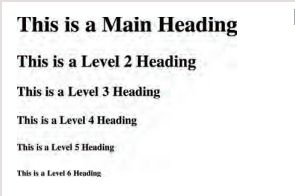

### Paragraphs

```
<p>
```
To create a paragraph, surround
the words that make up the
paragraph with an opening `<p>`
tag and closing `</p>` tag.

```
<p>A paragraph consists of one or more sentences
 that form a self-contained unit of discourse. The
 start of a paragraph is indicated by a new
 line.</p>
<p>Text is easier to understand when it is split up
 into units of text. For example, a book may have
 chapters. Chapters can have subheadings. Under
 each heading there will be one or more
 paragraphs.</p>
```
The result should be shown as: 
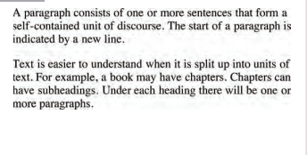

### Bold-&-Italic

- `<b>`

    By enclosing words in the tags
    `<b>` and `</b>` we can make
    characters appear bold.

    The `<b>` element also represents
a section of text that would be
presented in a visually different
way.

    ```
    <p>This is how we make a word appear <b>bold.</b>
    </p>
    <p>Inside a product description you might see some
    <b>key features</b> in bold.</p>
    ```
    the result would be showing as:
    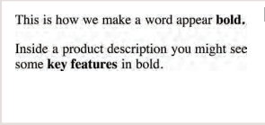

- `<i>`

    By enclosing words in the tags
    `<i>` and `</i>` we can make
    characters appear italic.

    The `<i>` element also represents
    a section of text that would be
    said in a different way from
    surrounding content.

    ```
    <p>This is how we make a word appear <i>italic</i>.
    </p>
    <p>It's a potato <i>Solanum teberosum</i>.</p>
    <p>Captain Cook sailed to Australia on the
    <i>Endeavour</i>.</p>
    ```
    The result should be shown as: 
    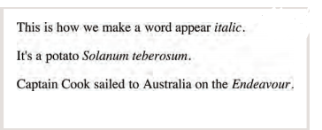

## Semantic-Markup

There are some text elements that are not intended to affect the
structure of your web pages, but they do add extra information to the
pages — they are known as semantic markup.

### Strong-&-Emphasis

- `<Strong>`

    The use of the `<strong>`
    element indicates that its
    content has strong importance.
    For example, the words
    contained in this element might
    be said with strong emphasis.

    ```
    <p><strong>Beware:</strong> Pickpockets operate in
    this area.</p>
    <p>This toy has many small pieces and is <strong>not
    suitable for children under five years old.
    </strong></p>
    ```
    The output is:
    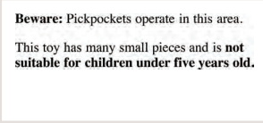

- `<em>`

    The `<em>` element indicates
    emphasis that subtly changes
    the meaning of a sentence.

    ```
    <p>I <em>think</em> Ivy was the first.</p>
    <p>I think <em>Ivy</em> was the first.</p>
    <p>I think Ivy was the <em>first</em>.</p>
    ```
    the output is:
    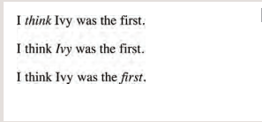

### Quotations

There are two elements
commonly used for marking up
quotations:

- `<blockquote>`

    The `<blockquote>` element is
    used for longer quotes that take
    up an entire paragraph. Note
    how the `<p>` element is still
    used inside the `<blockquote>`
    element.

    ```
    <blockquote cite="http://en.wikipedia.org/wiki/
    Winnie-the-Pooh">
    <p>Did you ever stop to think, and forget to start
    again?</p>
    </blockquote>
    <p>As A.A. Milne said, <q>Some people talk to
    animals. Not many listen though. That's the
    problem.</q></p>
    ```
    the result shown as:
    

- `<q>` 

    The `<q>` element is used for
    shorter quotes that sit within
    a paragraph. Browsers are
    supposed to put quotes around
    the `<q>` element, however
    Internet Explorer does not —
    therefore many people avoid
    using the `<q>` element.


### Changes-to-content

- `<ins>`
  `<del>`

    The `<ins>` element can be used
    to show content that has been
    inserted into a document, while
    the `<del>` element can show text
    that has been deleted from it.

    ```
    <p>It was the <del>worst</del> <ins>best</ins> idea
    she had ever had.</p>
    ```
    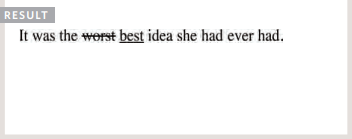

## Summary

- HTML elements are used to describe the structure of
the page (e.g. headings, subheadings, paragraphs).

- They also provide semantic information (e.g. where
emphasis should be placed, the definition of any
acronyms used, when given text is a quotation).


## Introducing-CSS

we will look at how to
make your web pages more attractive,
controlling the design of them using CSS.


## Understanding-CSS

The key to understanding how CSS works is to
imagine that there is an invisible box around
every HTML element.

### CSS-Style-Rules
CSS works by associating rules with HTML elements. These rules govern
how the content of specified elements should be displayed. A CSS rule
contains two parts: a selector and a declaration.
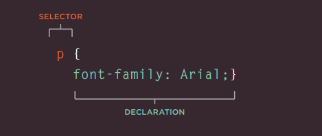

- This rule indicates that all `<p>`
elements should be shown in the
Arial typeface.

- **Selectors** indicate which
element the rule applies to.
The same rule can apply to
more than one element if you
separate the element names
with commas.

- **Declarations** indicate how
the elements referred to in
the selector should be styled.
Declarations are split into two
parts (a property and a value),
and are separated by a colon.

### CSS Properties Affect How Elements Are Displayed

CSS declarations sit inside curly brackets and each is made up of two
parts: a property and a value, separated by a colon. You can specify
several properties in one declaration, each separated by a semi-colon.

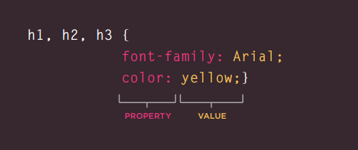

## Using-Externel-CSS

`<link>`
The `<link>` element can be used
in an HTML document to tell the
browser where to find the CSS
file used to style the page. It is an
empty element (meaning it does
not need a closing tag), and it
lives inside the `<head>` element.
It should use three attributes:

- **href**

    This specifies the path to the
    CSS file (which is often placed in
    a folder called css or styles).

- **type**

    This attribute specifies the type
    of document being linked to. The
    value should be text/css.

- **rel** 

    This specifies the relationship
    between the HTML page and
    the file it is linked to. The value
    should be stylesheet when
    linking to a CSS file.

## Using-Internal-CSS

- `<style>`

    You can also include CSS rules
    within an HTML page by placing
    them inside a `<style>` element,
    which usually sits inside the
    `<head>` element of the page.

    The `<style>` element should use
    the type attribute to indicate
    that the styles are specified in
    CSS. The value should be text/
    css.
```
<!DOCTYPE html>
<html>
<head>
 <title>Using Internal CSS</title>
 <style type="text/css">
 body {
 font-family: arial;
 background-color: rgb(185,179,175);}
 h1 {
 color: rgb(255,255,255);}
 </style>
</head>
<body>
 <h1>Potatoes</h1>
 <p>There are dozens of different potato
 varieties. They are usually described as
 early, second early and maincrop.</p>
</body>
</html>
```

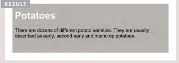

## CSS-Selector
There are many different types
of CSS selector that allow you to
target rules to specific elements
in an HTML document. 

The table on the opposite page
introduces the most commonly
used CSS selectors

```
<!DOCTYPE html>
<html>
<head>
 <title>CSS Selectors</title>
</head>
<body>
 <h1 id="top">Kitchen Garden Calendar</h1>
 <p id="introduction">Here you can read our
 handy guide about what to do when.</p>
 <h2>Spring</h2>
 <ul>
 <li><a href="mulch.html">
 Spring mulch vegetable beds</a></li>
 <li><a href="potato.html">
 Plant out early potatoes</a></li>
 <li><a href="tomato.html">
 Sow tomato seeds</a></li>
 <li><a href="beet.html">
 Sow beet seeds</a></li>
 <li><a href="zucchini.html">
 Sow zucchini seeds</a></li>
 <li><a href="rhubarb.html">
 Deadhead rhubarb flowers</a></li>
 </ul>
 <p class="note">
 This page was written by
 <a href="mailto:ivy@example.org">
 ivy@example.org</a> for
 <a href="http://www.example.org">Example</a>.
 </p>
 <p>
 <a href="#top">Top of page</a>
 </p>
</body>
</html>
```

## Inheritance 

If you specify the font-family
or color properties on the
`<body>` element, they will apply
to most child elements. This is
because the value of the
font-family property is
inherited by child elements. It
saves you from having to apply
these properties to as many
elements (and results in simpler
style sheets).


## External-Sheets

When building a website there are several advantages to placing your
CSS rules in a separate style sheet.

All of your web pages can share
the same style sheet. This is
achieved by using the `<link>`
element on each HTML page of
your site to link to the same CSS
document. This means that the
same code does not need to be
repeated in every page (which
results in less code and smaller
HTML pages). 

## Summary-CSS

- CSS treats each HTML element as if it appears inside
its own box and uses rules to indicate how that
element should look.
- Rules are made up of selectors (that specify the
elements the rule applies to) and declarations (that
indicate what these elements should look like).
- Different types of selectors allow you to target your
rules at different elements.

- Declarations are made up of two parts: the properties
of the element that you want to change, and the values
of those properties. For example, the font-family
property sets the choice of font, and the value arial
specifies Arial as the preferred typeface.

- CSS rules usually appear in a separate document,
although they may appear within an HTML page.


# JavaScript 

how JavaScript can be used
in browsers to make websites more interactive,
interesting, and user-friendly.

## Intro-JS-Scripts

How JavaScript Makes Web Pages More Interactive ?

1. Access Content 
    - You can use JavaScript to select any
element, attribute, or text from an
HTML page.

2. Modyfiyng Content
    - You can use JavaScript to add
elements, attributes, and text to the
page, or remove them.

3. Program Rules 
    - You can specify a set of steps for
the browser to follow (like a recipe),
which allows it to access or change the
content of a page.

4. React to Events 

    - You can specify that a script should run
when a specific event has occurred.

### The-ABC-of-programming 

Before you learn how to read and write the JavaScript
language itself, you need to become familiar with some key
concepts in computer programming. They will be covered in
three sections:

1. What is the Script and how i do a one ? 
    - To write a script, you need to first
    state your goal and then list the
    tasks that need to be completed in
    order to achieve it.

    - Once you know the goal of your script, you can work out the individuial tast needed to achive ti.

        

    - Designing A script steps: 
    Each individuial task may be broken down into a sequance of steps. When you are ready to code the script, these steps can the be translated into individuail line of code.

        
    
## Expressions-&-Operators

We use a variable to illustrates
how a scrip( contains very explicit instructions about
exactly what you want the computer to do).

### What-is-a-variable 
A script will have to temporarily
store the bits of information it.

### Rules-for-naming-variables 

Here are six rules you must always follow when giving a variable a name:

1. The name must begin with
a letter, dollar sign ($),or an
underscore (_). It must not start
with a number.

2. The name can contain letters,
numbers, dollar sign ($), or an
underscore (_). Note that you
must not use a dash(-) or a
period (.) in a variable name..

3. You cannot use keywords or
reserved words. Keywords
are special words that tell the
interpreter to do something. For
example, var is a keyword used
to declare a variable. Reserved
words are ones that may be used
in a future version of JavaScript. 


4. All variables are case sensitive,
so score and Score would be
different variable names, but
it is bad practice to create two
variables that have the same
name using different cases.  

5. Use a name that describes the
kind of information that the
variable stores. For example,
fi rstName might be used to
store a person's first name,
l astNarne for their last name,
and age for their age.  6. If your variable name is made
up of more than one word, use a
capital letter for the first letter of
every word after the first word.
For example, f i rstName rather
than fi rstnarne (this is referred
to as camel case). You can also
use an underscore between each
word (you cannot use a dash).  

### Arrays 

An array is a special type of variable. It doesn't
just store one value; it stores a list of values. 

You should consider using an
array whenever you are working
with a list or a set of values that
are related to each other.

### Creating-an-array 

You create an array and give it
a name just like you would any
other variable (using the var
keyword followed by the name of
the array). 

    var colors;
    colors = ['white', 'black', 'custom'];
    var el = document.getElementById('colors');
    el.textContent = colors[0];

### Values-in-the-Array 

Values in an array are accessed as if they are in
a numbered list. It is important to know that the
numbering of this list starts at zero (not one). 

1. Numbering Items in Array 

    Each item in an array is
    automatically given a number
    called an index. This can be used
    to access specific items in the
    array. Consider the following
    array which holds three colors:
    ```
    var colors;
    colors = ['white', 'black', 'custom'];
    ```
    Confusingly, index values start at
0 (not 1), so the following table
shows items from the array and
their corresponding index values:
    ```
        Index   Value

          0     'white'
          1     'black'
          2     'custom'
    ```
2. Accessing items in an array
    To retrieve the third item on the
    list, the array name is specified
    along with the index number in
    square brackets.

    Here you can see a variable
    called i temThree is declared.
    Its value is set to be the third
    color from the co 1 ors array. 
    ```
    var itemThree;
    itemThree = colors[2];
    ```
3. number of items in an array 

    Each array has a property called
    length, which holds the number
    of items in the array. 

    Below you can see that a variable
    called numCo 1 ors is declared. Its
    value is set to be the number of
    the items in the array.

    The name of the array is
    followed by a period symbol (or
    full stop) which is then followed
    by the 1 ength keyword.
    ```
    var numColors; 
    numColors = colors.length;
    ```

### Expressions 

An **expression** evaluates into (results in) a single value. Broadly speaking
there are two types of expressions. 

1. Expressions that just assign value to a variable.

    ```
    var color = 'beige';
    ```
thye value of color now is beige. 

2. Expressions that use tow or more values to return a single value. 

    You can perform operations on any number of
    individual values (see next page) to determine a
    single value. For example:

    ```
    var area = 3 * 2;
    ```
    the variable of area is now 6.

## Decisions-&-Loops 

There are often several places in a script where decisions are made that determine which lines if code should be run next. Flowcharts can help you plan for these occasions.

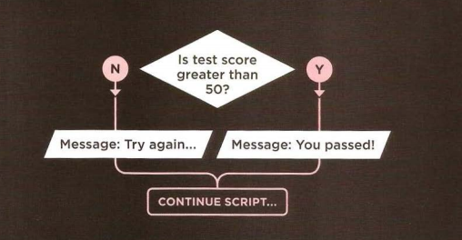

## Compariosn-operators

you can evaluate a situation by comparing one value in the script to what you expect it might be. the result will be boolean: **true** or **false**.

|     ==      |     !=      |
| ----------- | ----------- |
| Is equal to | Is not equal to |

- Is Equal To:

    This operator compares two values(Numbers, Strings or Booleans) to see if they are the same.

    `'Hello'` == `'Goodbye'` return false, becasue they are not the same data type and value are the same. 

- Is Not Equal to:

    This operator compares two values(Numbers, Strings or Booleans) to see if they are not the same.

    `'Hello'` != `'Goodbye'` returns true because they are not the same.


|     ===     |     !==     |
| ----------- | ----------- |
| Strict equal to | Strict not equal to |


- Strict equal to: 

    This operator compares two values to check that both the data types and value are the same.

    `'3'` === `3` return false because the are not the same data type or value.

- Strict not equal:

    This operator compares two values to check that both the data type and value are not the same.

### Structuring-comparison-operators 

In any condition, there is usually one operator and two operands.The opernads are placed on each side of the operator. They can be values or variables. You can often see expressions enclosed in brackets.


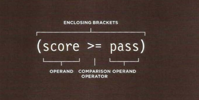

The enclosing brackets are important when the expression used as a condition in a comparison operator. But when you are assining a value to a variable, they are not needed.


## Logical-operators 

Comparison operators usually return single values of `true` or `false`.
Logical operators allow you to compare the results of more than one comparison operator.

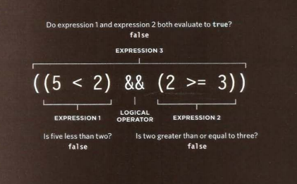

In this one line of code are three expressions, each of which will resolve to the value `true` or `false`.

The expressions on the left and the right both use comparison operators, and both return `false`.

The third expression uses a logical operator(rather than a comparison operator). The logical AND operator checks to see whether both expression on either side of it return `true`.

- Logical AND ( && ):

    ```
    ((2 < 5 ) && (3 >= 2))
    ```
    returns `true`

If both expressions evaluate to `true` the the expressions returns `true`. if just one of these returns `false`, then the expressions will return `false`.

```
true && true returns true
true && false returns false
false && true returns false
false && false returns false
```

- Logical OR ( || ):

    ```
    ((2 < 5 ) && (2 < 1))
    ```
    return true

This operator tests at least ine condition.


If either expressions evaluate to `true` the the expressions returns `true`. if both of these returns `false`, then the expressions will return `false`.

```
true || true returns true
true || false returns true
false || true returns true
false || false returns false
```


- Logical NOT( ! ):

    This operator takes a single Boolean value and inverts it.

    ```
    !(2 < 1)
    ```
    returns true

The reverse the state of an expression. if it was `false`, it would return `true`. if the staement was `true`, it would return `false`.

```
!true returns false
!false returns true
```


## Loops 

Loops check a condition. if it returns `true`, a code block will run.
Then the condition will be checked again and if it still returns `true`, the code clock will run again. it repeats until the condition returns `false`.

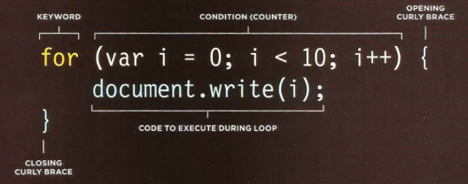

There are three common types of loops: 

#### FOR 

if you want ti run code a specific number of times, use a for loop.
in a for loop, the condition is usually a counter which is used ti tell how many times the loop should run.

#### WHILE 

If you do know how manu time the code shoukd run, you cac use a while loope. Here the condition can be something other than a counter, and the code will continue to loop for as long as the condition is true.


#### DO-WHILE 

the do ... while loop is very similir to the while loop, but has one key difference: it will always run the statements inside the block at least once, even if the condition evaluates to false.

### Loop-counter 

a for loop uses a counter as condition. This instructs the code to reun a specified number of times.
Here you can see the condition is made up of three statements: 

- Initialization 

    create a variable and set it to 0.

    ```
    var i = 0;
    ```

- Condition

    The loop should continue to run until the counter reaches a specified number.

    ```
    i < 10;
    ```

- Update 

    Every time the loop has run the statement in the curly braces, it adds to the counter.

    ```
    i++
    ```

## Using-while-Loops 
Here is an example of a while loop. it writes out hte 5 times table. Each time the loop is run, another calculation is written into the variavle called **msg**.
```
var i = 1;      //Set counter to 1
var msg = '';   //Message

// Store 5 times table in a variable 
while (i < 10){
    msg += i + ' x 5 = ' + (i * 5) + '<br>';
    i++;
}
document.getElementById('answer').innerHTML = msg;
```