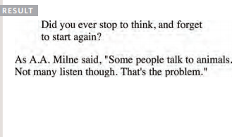

# Basics of HTML, CSS & JS

<details open>
<summary>Table of Content</summary>
<br>

1. [HTML Text](#HTML-Text)
    - [Headings](#Headings)
    - [Paragraphs](#Paragraphs)
    - [Bold & Italic](#Bold-&-Italic)
1. [Semantic-Markup](#Semantic-Markup)
    - [Strong & Emphasis](#Strong-&-Emphasis)
    - [Quotations](#Quotations)
    - [Changes to content](#Changes-to-content)
1. [Html Summary](#Summary)


## HTML-Text

I this file you are going to learn about how to add markup to the text that appears in the web pages.

### Headings

```
<h1>
<h2>
<h3>
<h4>
<h5>
<h6>
```
Html has six **levels** of headings.

`<h1>` is used for headings.
`<h2>` is used for sub-headings.

```
<h1>This is a Main Heading.</h1>
<h2>This is a Level 2 Heading.</h2> 
<h3>This is a Level 3 Heading.</h3>
<h4>This is a Level 4 Heading.</h4>
<h5>This is a Level 5 Heading.</h5>
<h6>This is a Level 6 Heading.</h6>
```
The result would be shown as:


### Paragraphs

```
<p>
```
To create a paragraph, surround
the words that make up the
paragraph with an opening `<p>`
tag and closing `</p>` tag.

```
<p>A paragraph consists of one or more sentences
 that form a self-contained unit of discourse. The
 start of a paragraph is indicated by a new
 line.</p>
<p>Text is easier to understand when it is split up
 into units of text. For example, a book may have
 chapters. Chapters can have subheadings. Under
 each heading there will be one or more
 paragraphs.</p>
```
The result should be shown as: 


### Bold-&-Italic

- `<b>`

    By enclosing words in the tags
    `<b>` and `</b>` we can make
    characters appear bold.

    The `<b>` element also represents
a section of text that would be
presented in a visually different
way.

    ```
    <p>This is how we make a word appear <b>bold.</b>
    </p>
    <p>Inside a product description you might see some
    <b>key features</b> in bold.</p>
    ```
    the result would be showing as:
    

- `<i>`

    By enclosing words in the tags
    `<i>` and `</i>` we can make
    characters appear italic.

    The `<i>` element also represents
    a section of text that would be
    said in a different way from
    surrounding content.

    ```
    <p>This is how we make a word appear <i>italic</i>.
    </p>
    <p>It's a potato <i>Solanum teberosum</i>.</p>
    <p>Captain Cook sailed to Australia on the
    <i>Endeavour</i>.</p>
    ```
    The result should be shown as: 
    

## Semantic-Markup

There are some text elements that are not intended to affect the
structure of your web pages, but they do add extra information to the
pages — they are known as semantic markup.

### Strong-&-Emphasis

- `<Strong>`

    The use of the `<strong>`
    element indicates that its
    content has strong importance.
    For example, the words
    contained in this element might
    be said with strong emphasis.

    ```
    <p><strong>Beware:</strong> Pickpockets operate in
    this area.</p>
    <p>This toy has many small pieces and is <strong>not
    suitable for children under five years old.
    </strong></p>
    ```
    The output is:
    

- `<em>`

    The `<em>` element indicates
    emphasis that subtly changes
    the meaning of a sentence.

    ```
    <p>I <em>think</em> Ivy was the first.</p>
    <p>I think <em>Ivy</em> was the first.</p>
    <p>I think Ivy was the <em>first</em>.</p>
    ```
    the output is:
    

### Quotations

There are two elements
commonly used for marking up
quotations:

- `<blockquote>`

    The `<blockquote>` element is
    used for longer quotes that take
    up an entire paragraph. Note
    how the `<p>` element is still
    used inside the `<blockquote>`
    element.

    ```
    <blockquote cite="http://en.wikipedia.org/wiki/
    Winnie-the-Pooh">
    <p>Did you ever stop to think, and forget to start
    again?</p>
    </blockquote>
    <p>As A.A. Milne said, <q>Some people talk to
    animals. Not many listen though. That's the
    problem.</q></p>
    ```
    the result shown as:
    

- `<q>` 

    The `<q>` element is used for
    shorter quotes that sit within
    a paragraph. Browsers are
    supposed to put quotes around
    the `<q>` element, however
    Internet Explorer does not —
    therefore many people avoid
    using the `<q>` element.


### Changes-to-content

- `<ins>`
  `<del>`

    The `<ins>` element can be used
    to show content that has been
    inserted into a document, while
    the `<del>` element can show text
    that has been deleted from it.

    ```
    <p>It was the <del>worst</del> <ins>best</ins> idea
    she had ever had.</p>
    ```
    

## Summary

- HTML elements are used to describe the structure of
the page (e.g. headings, subheadings, paragraphs).

- They also provide semantic information (e.g. where
emphasis should be placed, the definition of any
acronyms used, when given text is a quotation).


## Introducing-CSS

we will look at how to
make your web pages more attractive,
controlling the design of them using CSS.


## Understanding-CSS

The key to understanding how CSS works is to
imagine that there is an invisible box around
every HTML element.

### CSS Style Rules
CSS works by associating rules with HTML elements. These rules govern
how the content of specified elements should be displayed. A CSS rule
contains two parts: a selector and a declaration.


- This rule indicates that all `<p>`
elements should be shown in the
Arial typeface.

- **Selectors** indicate which
element the rule applies to.
The same rule can apply to
more than one element if you
separate the element names
with commas.

- **Declarations** indicate how
the elements referred to in
the selector should be styled.
Declarations are split into two
parts (a property and a value),
and are separated by a colon.

### CSS Properties Affect How Elements Are Displayed

CSS declarations sit inside curly brackets and each is made up of two
parts: a property and a value, separated by a colon. You can specify
several properties in one declaration, each separated by a semi-colon.


## Using Externel CSS

`<link>`
The `<link>` element can be used
in an HTML document to tell the
browser where to find the CSS
file used to style the page. It is an
empty element (meaning it does
not need a closing tag), and it
lives inside the `<head>` element.
It should use three attributes:

- **href**

    This specifies the path to the
    CSS file (which is often placed in
    a folder called css or styles).

- **type**

    This attribute specifies the type
    of document being linked to. The
    value should be text/css.

- **rel** 

    This specifies the relationship
    between the HTML page and
    the file it is linked to. The value
    should be stylesheet when
    linking to a CSS file.

## Using Internal CSS

- `<style>`

    You can also include CSS rules
    within an HTML page by placing
    them inside a `<style>` element,
    which usually sits inside the
    `<head>` element of the page.

    The `<style>` element should use
    the type attribute to indicate
    that the styles are specified in
    CSS. The value should be text/
    css.
```
<!DOCTYPE html>
<html>
<head>
 <title>Using Internal CSS</title>
 <style type="text/css">
 body {
 font-family: arial;
 background-color: rgb(185,179,175);}
 h1 {
 color: rgb(255,255,255);}
 </style>
</head>
<body>
 <h1>Potatoes</h1>
 <p>There are dozens of different potato
 varieties. They are usually described as
 early, second early and maincrop.</p>
</body>
</html>
```


## CSS Selector
There are many different types
of CSS selector that allow you to
target rules to specific elements
in an HTML document. 

The table on the opposite page
introduces the most commonly
used CSS selectors

```
<!DOCTYPE html>
<html>
<head>
 <title>CSS Selectors</title>
</head>
<body>
 <h1 id="top">Kitchen Garden Calendar</h1>
 <p id="introduction">Here you can read our
 handy guide about what to do when.</p>
 <h2>Spring</h2>
 <ul>
 <li><a href="mulch.html">
 Spring mulch vegetable beds</a></li>
 <li><a href="potato.html">
 Plant out early potatoes</a></li>
 <li><a href="tomato.html">
 Sow tomato seeds</a></li>
 <li><a href="beet.html">
 Sow beet seeds</a></li>
 <li><a href="zucchini.html">
 Sow zucchini seeds</a></li>
 <li><a href="rhubarb.html">
 Deadhead rhubarb flowers</a></li>
 </ul>
 <p class="note">
 This page was written by
 <a href="mailto:ivy@example.org">
 ivy@example.org</a> for
 <a href="http://www.example.org">Example</a>.
 </p>
 <p>
 <a href="#top">Top of page</a>
 </p>
</body>
</html>
```

## Inheritance 

If you specify the font-family
or color properties on the
`<body>` element, they will apply
to most child elements. This is
because the value of the
font-family property is
inherited by child elements. It
saves you from having to apply
these properties to as many
elements (and results in simpler
style sheets).


## External-Sheets

When building a website there are several advantages to placing your
CSS rules in a separate style sheet.

All of your web pages can share
the same style sheet. This is
achieved by using the `<link>`
element on each HTML page of
your site to link to the same CSS
document. This means that the
same code does not need to be
repeated in every page (which
results in less code and smaller
HTML pages). 

## Summary-CSS

- CSS treats each HTML element as if it appears inside
its own box and uses rules to indicate how that
element should look.
- Rules are made up of selectors (that specify the
elements the rule applies to) and declarations (that
indicate what these elements should look like).
- Different types of selectors allow you to target your
rules at different elements.

- Declarations are made up of two parts: the properties
of the element that you want to change, and the values
of those properties. For example, the font-family
property sets the choice of font, and the value arial
specifies Arial as the preferred typeface.

- CSS rules usually appear in a separate document,
although they may appear within an HTML page.